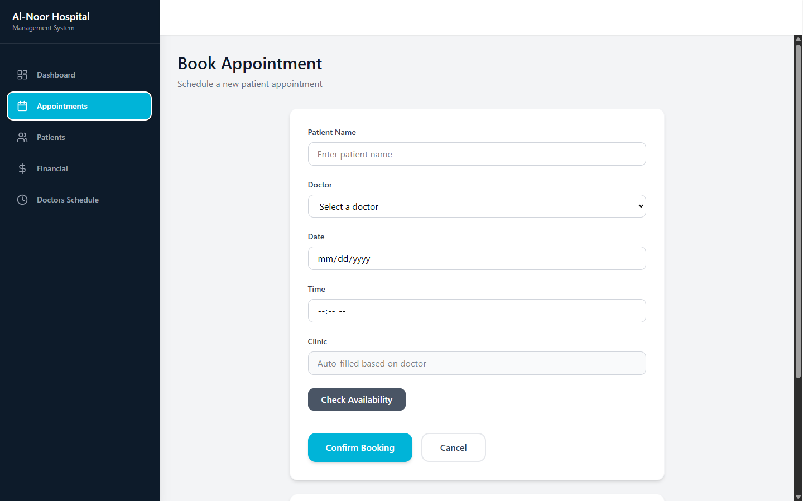
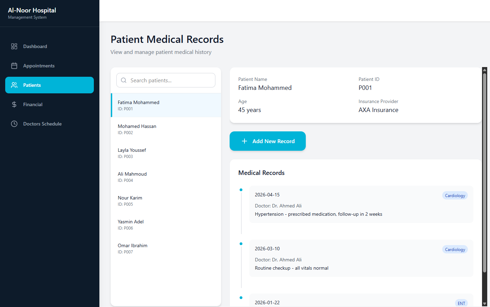
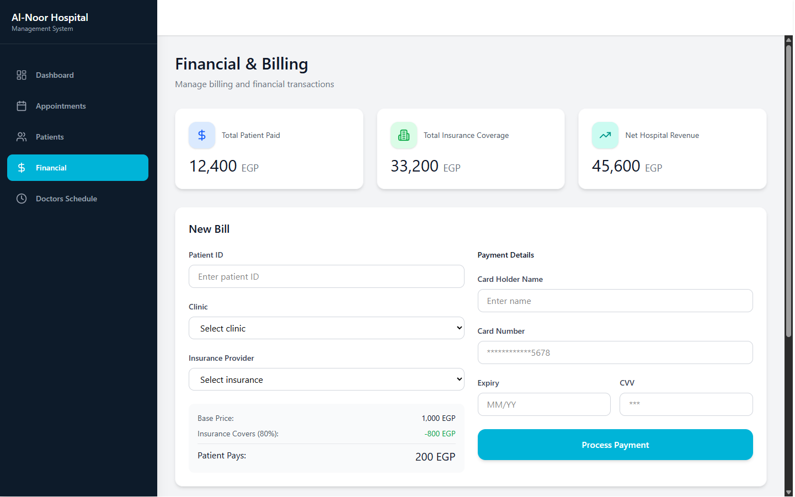
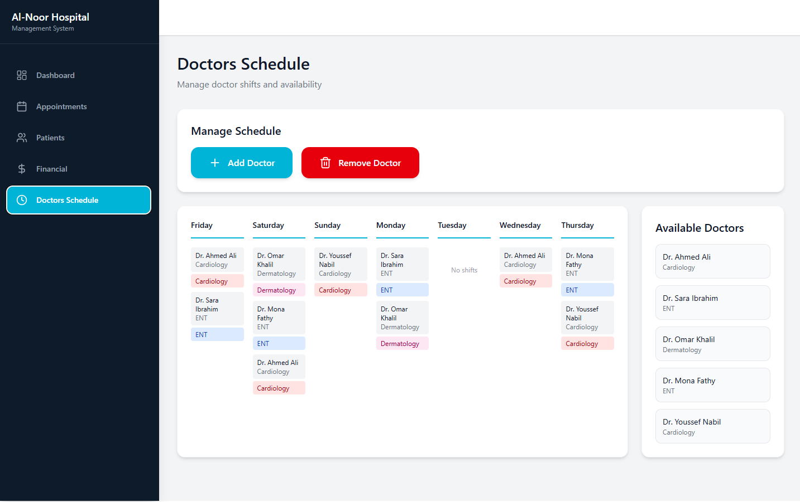

# Al-Noor Hospital Management System 🏥

A desktop hospital management application built with **C++ and Qt**, developed as a university project at the **Egyptian Chinese University (ECU)**. The system covers patient registration, appointment scheduling, medical records, financial billing, and doctor/clinic management — all through a clean, modern GUI.

---

## What the system does

When you open the app, you land on a dashboard that gives you the key numbers at a glance — total patients, today's appointments, doctors on duty, and revenue. From there you navigate between five main sections:

**Dashboard** — Real-time summary of all hospital activity. Quick shortcut buttons let you jump straight to booking an appointment or creating a bill without hunting through menus.

**Appointments** — Book appointments for patients by picking a doctor and time slot. The system automatically checks for scheduling conflicts so no doctor ever gets double-booked. Shows a live view of the selected doctor's schedule for today alongside a full appointment history list.

**Patients** — Complete patient records with full medical history timelines. Add new patients, attach medical records per visit, search by name or ID, and edit details when needed.

**Financial** — Billing screen with fixed clinic pricing (ENT: 500 EGP, Dermatology: 600 EGP, Cardiology: 1,000 EGP). Automatically applies insurance discounts (AXA 80%, MetLife 70%, Allianz 90%) and processes card payments. Keeps a persistent log of every bill with totals for patient payments, insurance coverage, and net hospital revenue.

**Doctors Schedule** — Weekly calendar view of doctor assignments per clinic. Doctors can be added or removed from the schedule directly from this screen.

---
## Screenshots







---
## User Roles

The system supports three roles:

| Role | Access |
|---|---|
| Admin | Full access to all modules including doctor management and system configuration |
| Receptionist | Patient registration, appointment booking, billing and checkout |
| Doctor | View-only access to patient records and their own appointment list |

---

## Tech Stack

- **Language:** C++ (C++17)
- **GUI Framework:** Qt 6 (Widgets)
- **Build system:** qmake (.pro file)
- **Data storage:** Plain structured text files (`doctors.txt`, `patient.txt`, `mr.txt`, `financial_records.txt`)
- **IDE:** Qt Creator

No external databases or third-party libraries beyond Qt. All data structures were implemented from scratch — dynamic arrays for doctors and clinics, manual linked structures for patient medical records.

---

## Project Structure

```
Hospital_System/
│
├── AppointmentSystem/
│   ├── Queue_backend.h          ← Appointment queue logic & conflict detection
│   ├── appointmentspage.h
│   └── appointmentspage.cpp     ← Booking form UI + today's schedule table
│
├── ClinicsAndDoctors/
│   ├── Doctors_Clinicsbackend.h ← Doctor & Clinic classes, dynamic arrays, file loading
│   ├── schedulepage.h
│   └── schedulepage.cpp         ← Weekly schedule calendar UI
│
├── FinancialSystem/
│   ├── Financebackend.h         ← Insurance pricing, billing manager, payment processing
│   ├── financialpage.h
│   └── financialpage.cpp        ← Billing form + recent records table UI
│
├── PatientRecords/
│   ├── Patientbackend.h         ← Patient & medical record classes, file I/O
│   ├── patientspage.h
│   ├── patientspage.cpp         ← Patient list, search, and record management UI
│   ├── dashboardpage.h
│   └── dashboardpage.cpp        ← KPI cards + today's appointment table
│
└── HospitalSystem/
    ├── backend.h                ← Unified backend header (all modules combined)
    ├── mainwindow.h
    ├── mainwindow.cpp           ← Main window, sidebar navigation, page switching
    ├── main.cpp                 ← Application entry point
    ├── AlNoorHospital.pro       ← Qt project file
    └── resources.qrc
```

---

## How to Run

**Requirements:** Qt 6 installed with Qt Creator

```bash
git clone https://github.com/Zeyad-101/Hospital_System.git
cd Hospital_System
```

Open `AlNoorHospital.pro` in Qt Creator → **Build → Run** (Ctrl+R)

The app looks for `doctors.txt`, `patient.txt`, and `mr.txt` in the same directory as the executable. If they're not found, sample data loads automatically so you can explore the interface right away.

**Data file formats:**

`doctors.txt` — `ID,Name,Specialization`
```
1001,Dr. Samy Abdullah,ENT
1007,Dr. Sherif Mahmoud,Cardiology
```

`patient.txt` — `ID,Name,Age,InsuranceProvider`
```
P-101,Basma Mohamed,20,AXA
P-102,Adam Ghobashy,19,None
```

`mr.txt` — `RecordID,PatientID,Date,Clinic,Diagnosis,DoctorID`
```
MR-001,P-101,2026-04-09,ENT,Ear Infection,1001
```

**Operating environment:**
- Windows 10/11 (primary) or Linux Ubuntu 20.04+
- GCC 9+ or MSVC 2019+ with C++17 support
- Minimum 512 MB RAM, 1024×768 display

---

## Key Features by Module

| Module | Highlights |
|---|---|
| Patient Management | Register patients with manual ID assignment, partial-name search, full visit history |
| Doctor Management | Weekly schedule assignment, filter by specialization, add/remove doctors |
| Appointments | Conflict-free booking via queue, status tracking (Scheduled / Completed / Cancelled) |
| Medical Records | Per-visit records linked to doctor and clinic, reverse-chronological history view |
| Billing | Fixed clinic pricing + insurance discount calculation, card payment processing, bill log |
| Dashboard | Live KPI cards, today's appointments table, quick-action shortcuts |

---

## Team

| Name | ID | GitHub |
|---|---|---|
| Zeyad Waleed Amin | 192400694 | [@Zeyad-101](https://github.com/Zeyad-101) 
| Mai Ahmed Khalaf | 192400685 | [@MaiKhalaf](https://github.com/MaiKhalaf) 
| Adam Tamer Ghobashy | 192400667 | [@Adam-Ghobashy](https://github.com/Adam-Ghobashy) 
| Basma Mohamed Ibrahim | 192400703 | [@basmamohamedd0](https://github.com/basmamohamedd0) 
| Hazem Mohamed Hmady | 192400671 | [@hazemMo7amed](https://github.com/hazemMo7amed) 
| Judy Ehab Abdelmagied | 192400739 | 
| Maha Mohamed Nasr | 192400778 | [@mahhanasr](https://github.com/mahhanasr)

---

## Design Prototype

The UI was prototyped in Figma before implementation:  
[View Figma Design](https://www.figma.com/make/OaFT4mH0KySLfhhEsafaQL/Untitled?t=U76pxIBsgvBBZMpF-1&preview-route=%2Fpatients)

---

## Notes & Limitations

- Data saves to text files on write operations (new patient, new bill, etc.). There is no full save-on-exit yet — something we would add with more time.
- The appointment system prevents a doctor from being double-booked at the same time slot, but does not restrict the same patient from appearing with multiple doctors simultaneously.
- Card details are cleared from memory immediately after a transaction processes — nothing is stored to disk.
- The system is single-user per session. Concurrent multi-user access is not supported in v1.0.

---

*Data Structures course project — Egyptian Chinese University, Faculty of Software Engineering.*
